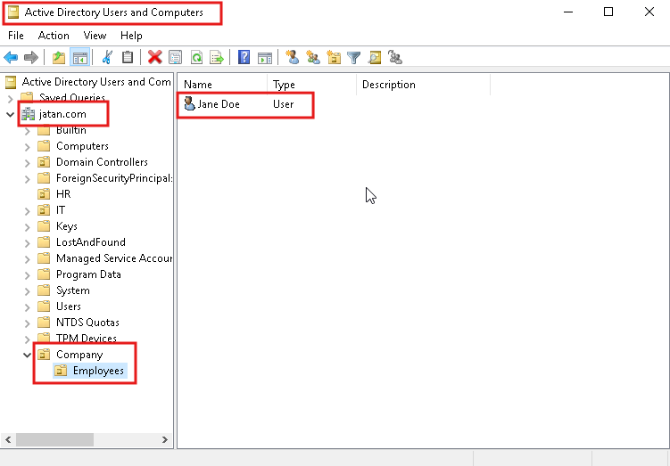
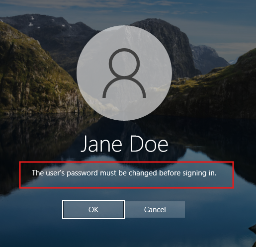

# HomeLab
My hands-on home lab documentation for Windows Server, Active Directory, and IT support skills.
---

## Day 1: Creating & Managing OUs and Users in Active Directory

### Summary
In this lab, I established a clean organizational structure by creating new Organizational Units (OUs) for the company and its employees. I then performed the complete user lifecycle management process:
* **Onboarding:** Created a new user (`jdoe`) in the correct OU with a temporary password set to expire on first login, a critical security practice.
* **Testing:** Logged into a Windows 10 domain-joined client as the new user and successfully completed the forced password change.
* **Troubleshooting:** Simulated a common helpdesk ticket by locking the user account.
* **Resolution:** Resolved the issue from the server by unlocking the account and resetting the user's password.

### Screenshots

